**Introduction:**

> Suppose you are a member of a manufacturer or semiconductor company,
> tasked with designing their new products or IC Chips which needs a lot
> of CAE (Computer Aided Engineering) or EDA (Electronic Design
> Automation) simulation. You do not have sufficient capacity on
> premises for this project and so will be using Azure for those HPC
> simulation needs. Management would like this project to be completed
> in a timely and cost-effective manner. You choose Azure NetApp Files
> (ANF) as the back-end storage solution as it provides an
> on-premises-like experience and performance. You will need to figure
> out the most optimal and cost-effective way of building and running
> your HPC applications in Azure.
>
> In this module, you will learn how to choose proper ANF service level
> and volume quota for your HPC applications, create and configure ANF
> and mount an ANF volume from Virtual Machines, and some practical
> performance tuning practice.

-   **Learning objectives**

    -   **Learn how to choose proper tier and volume size when running
        your HPC applications on Azure NetApp Files.**

    -   **Learn how to create and configure ANF, and mount an ANF
        volume.**

    -   **Learn practical performance tuning practice.**

-   **Prerequisites**

    -   Can deploy virtual machines (VM) in Azure.

**Next unit: Understand ANF's storage hierarchy.**

**Understand ANF's storage hierarchy.**

-   5 minutes

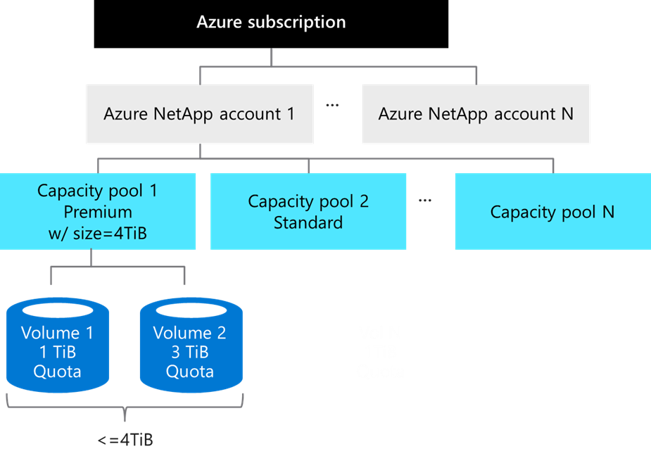

1\) Azure NetApp Files account is primarily an administrative concept
and is in regional scope. You will need to create an ANF account first.

2\) Then you will need to create Capacity Pools under your ANF account.
A single ANF account can have up to 25 Pools. The provisioned size of
each Pool can then be assigned to Volumes within it. In this example we
provisioned 4TB to Capacity Pool 1. This Pool is also assigned a
"Premium" ANF service level, which we\'ll discuss in next section.
Please note that ANF is charged based on the provisioned size of
Capacity Pools. Size of Pools can vary from 4TB to 500TB each.

3\) Volumes are the actual constructs which will be mounted from your
VM(s) and being consumed. They\'re assigned a quota limit, which can
range from 100GB to 100TB, and the total Volume capacity cannot exceed
the provision size of the Capacity Pool. In this example, there are 2
Volumes within Capacity Pool 1 and the total quota limit cannot exceed
4TiB. All Volumes in a Pool will have the same service level, Premium in
this example.

**Next unit: Understand ANF performance regarding to service level and
volume quota.**

**Understand ANF performance regarding to service level and volume
quota.**

-   5 minutes

ANF performance, respecting to throughput, is simple to design and easy
to configure. As illustrated in below figure, there are TWO key factors
involved: the 1^st^ is Service Level, which establishes the baseline
level of performance, and the 2^nd^ is the Volume quota. You get the
gross performance limit of the Volume by multiplying the two factors.

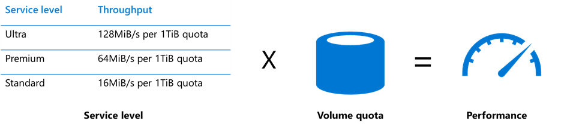

For example:

-   If you choose Premium as Service level, you will get 64MiB/sec for
    every 1TiB of quota within the Volume.

-   You provision a Volume with a 10TB quota, then that Volume can
    deliver up to 64\*10=640MiB/sec of throughput.

Please note that the gross throughput is set by the quota of the Volume,
not the actual capacity consumed in the Volume.

Also, you can increase or decrease the quota of your Volume in anytime,
and it will affect the performance behavior virtually instantly. You do
not need to reboot your VM nor to re-mount your Volume.

How do you know the needed bandwidth of throughput? If you know both the
IOPS and the transfer size of your workload, you can calculate the
bandwidth required by multiplying them together. For example, if your
workloads need 100,000 IOPS and have an averaged transfer size of 16KB,
then the bandwidth required is 1.53 GB per second. Based on this, you
will be able to choose proper Service Level and Volume quota.

100,000 IOPS \* 16KB = 1,600,000 KB/s = 1.53 GB/s

It\'s important to keep in mind that in real-world, storage performance
is impacted by a wide range of factors, including the Read/Write mix,
block size mix, and access patterns like random or sequential access.

**Knowledge Check**

-   3 minutes

Choose the best response for each question. Then select **Check your
answers**.

**Check your knowledge.**

Top of Form

1.  What's the top-down order of Azure NetApp Files storage hierarchy:

- ANF Account -\> ANF Container -\> Volume

- Capacity Pool -\> ANF Account -\> Volume

- ANF Account -\> Capacity Pool -\> Volume

- ANF Account -\> Capacity Pool -\> Storage Target

2. Your HPC applications need at least 50TiB size of file storage, and
you would like to ensure 3,000MiB/sec in throughput. With below
knowledge, which of the following ANF Service Level and volume quota
would you choose?

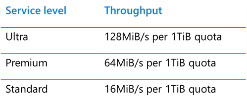

- Ultra + 25TiB

- Premium + 50TiB

- Standard + 100Tib

- None of above is feasible.

- All above are feasible.

3. You would like to resize your ANF Volume size to reflect different
HPC applications' performance requirements, you need to perform below
actions to make those change effective:

- umount and mount the Volumes.

- Reboot all VMs connecting to Volumes.

- None of above, ANF will just affect performance change almost
immediately.

Check your answers.

**Next unit: \[Hands-on\] Create an ANF Volume**

**\[Hands-on\] Create an ANF Volume**

Please follow below tutorial to create an ANF account, a 4TiB Premium
Capacity pool, and a 4TiB Volume.

[Create a NetApp account for Access Azure NetApp Files \| Microsoft
Docs](https://docs.microsoft.com/en-us/azure/azure-netapp-files/azure-netapp-files-create-netapp-account)

[Set up a capacity pool for Azure NetApp Files \| Microsoft
Docs](https://docs.microsoft.com/en-us/azure/azure-netapp-files/azure-netapp-files-set-up-capacity-pool)

Your ANF hierarchy will be like below:

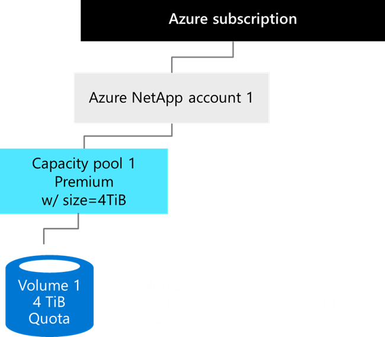

After you successfully created an ANF Volume, please follow [Mount Azure
NetApp Files volumes for virtual machines \| Microsoft
Docs](https://docs.microsoft.com/bs-latn-ba/azure/azure-netapp-files/azure-netapp-files-mount-unmount-volumes-for-virtual-machines)
to mount the Volume from a VM. ANF supports NFS 3.0, NFS 4.1 and SMB 3.1
protocols.

If the data consumed in your Volume exceeds the quota, 4TB in this
example, ANF will not reject writes. This is the principle that ANF will
try to avoid any data loss and data corruption. The pool size will
increase incrementally until Pool size is greater than your consumed
size. And that is the reason your will see df -h is showing 100TB in
size all the time, as 100TB is the maximum Pool size allowed.

\$ df -h

Filesystem Size Used Avail Use% Mounted on

x.x.x.x:/anfvol1 100T 0 100T 0% /anfvol1

**Next unit: ANF Scalability**

**ANF Scalability**

In real world, HPC workloads like EDA are running on hundreds or
thousands of nodes (VMs) connecting to the same storage server. And it's
critical that the storage server can scale properly and still perform
well when workloads increase.

The[ SPEC SFS® 2014 benchmark](https://www.spec.org/sfs2014/) suite
provides a standardized method to measure file server throughput and
response time. It simulates real-world workloads including Database,
EDA, Software Builds, VDA Streaming, and Desktop VDI scenarios.

Below the test results of EDA scenario:

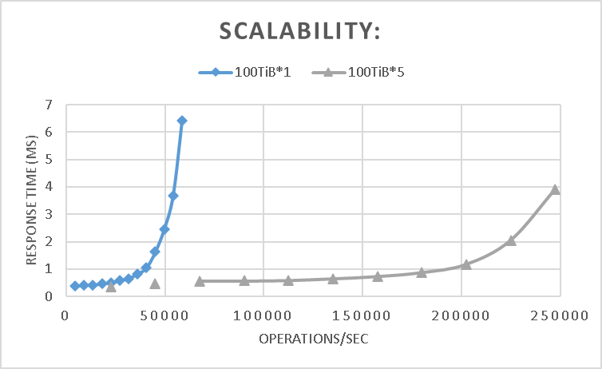

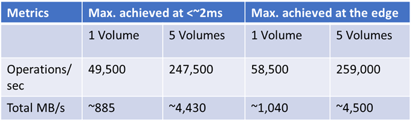

You can see that by simply adding \# of Volumes to ANF, maximum
throughput can scale linearly, and still maintaining low response time.
(\~500% from 1 to 5 volumes)

**Next unit: Performance tips (actimeo and nocto)**

**Performance tips (actimeo and nocto)**

Beginning from this Unit, some general practice to improve performance
including ANF will be discussed.

**actimeo**

For applications that use grids of clients like EDA, web hosting and
movie rendering and have relatively static data sets, there will have
many getattr/access calls coming back to storage during the run. In
these cases, there is a known lag in picking up new content and the
application still works with potentially out of date data. For those
scenarios, nocto and actimeo can be used to control the time period
where out of data date can be managed.

For example, in EDA with tools and libraries and other static content,
actimeo=600 works well because this data is typically updated
infrequently. Using this mount options reduce the workload to storage
significantly in these cases. A recent EDA experience reduced IOPS to
the tool volume from \>150K to \~6K and latency cut in half from
\~2.08ms to \~1.05ms. It also reduced overall CPU% and load on the ANF
nodes, and applications can run significantly faster.

The downside of setting the actimeo value too high is that attributes
that change might not be reflected properly until the cache timeout
occurs, which could result in unpredictable access issues.

**nocto**

The nocto option is used primarily to increase raw performance. For
example, in the same vdbench tests run, the nocto mount option reduced
latency by an additional 0.35ms to 0.7ms.

The recommendation for use of the nocto option is to use only with
read-heavy/read-mostly workloads.

The charts below show latency reduced from \~2.08ms with default
settings, to \~1.05ms with 'actimeo=60', and to \~0.7ms with both
'actimeo=600,nocto'.

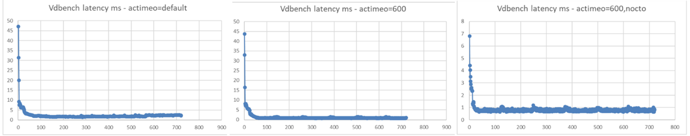

REFERENCE: [TR-4067: NFS in NetApp ONTAP Best Practice and
Implementation Guide](https://www.netapp.com/media/10720-tr-4067.pdf)

**Next unit: Performance tips (sysctl)**

**Performance tips (sysctl)**

sysctl is used to modify kernel parameters at runtime. You can use
sysctl to both read and write sysctl data. Well-tuning sysctl can help
improve overall performance. Below the example implemented on Azure
Ev4/Dv4 VMs.

\$ sudo vi /etc/sysctl.conf

// Add or modify below attributes:

> net.core.somaxconn = 65536
>
> net.core.netdev_max_backlog = 300000
>
> net.core.rmem_default = 67108864
>
> net.core.wmem_default = 67108864
>
> net.core.rmem_max = 67108864
>
> net.core.wmem_max = 67108864
>
> net.ipv4.tcp_rmem = 8192 87380 16777216
>
> net.ipv4.tcp_wmem = 8192 87380 16777216
>
> net.ipv4.tcp_fin_timeout = 5

//

\$ sudo sysctl -p

REFERENCE: [sysctl - ArchWiki
(archlinux.org)](https://wiki.archlinux.org/index.php/sysctl)

**Next unit: Performance tips (nconnect)**

**Performance tips (nconnect)**

**"nconnect"**, included in Linux kernel versions \>= 5.3, is a feature
that enables multiple TCP connections for a single NFS mount. Setting
"nconnect" as a mount option enables the NFS client to open multiple
"transport connections" for the same host and can boost performance in
many HPC scenarios.

You can use uname -r to check Linux kernel version. Below the example to
upgrade your VMs to the latest version of Linux kernel. Please note that
you will need to reboot the VM at the end of the upgrade. So it might
not be applicable for some cases.

\# CentOS/Redhat 7+

\$ sudo rpm -Uvh
<http://www.elrepo.org/elrepo-release-7.0-2.el7.elrepo.noarch.rpm>

\# CenOS/Redhat 8+

\$ sudo rpm \--import https://www.elrepo.org/RPM-GPG-KEY-elrepo.org

\$ sudo yum -y \--enablerepo=elrepo-kernel install kernel-ml

\$ sudo reboot

\$ sudo mount -t nfs -o rw,**nconnect=16**,nocto,actimeo=600,
x.x.x.x:/vol1 /anfvol

**Next unit: Performance tips (conclusion)**

**Performance tips (conclusion)**

First let's examine the effectiveness of the 3 options we have discussed
in previous units.

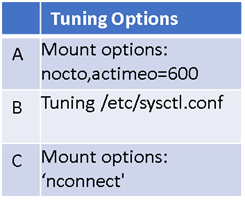

1.  Below the FIO IOPS and Bandwidth test on random and sequential
    reads/writes. You can see those options all boost performance and
    the effectiveness can be added up.

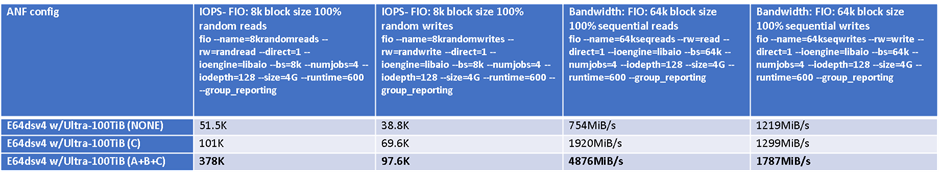

2.  Below the EDA workload benchmark results applying the three options,
    you can see overall throughput improved significantly while
    maintaining low response time.

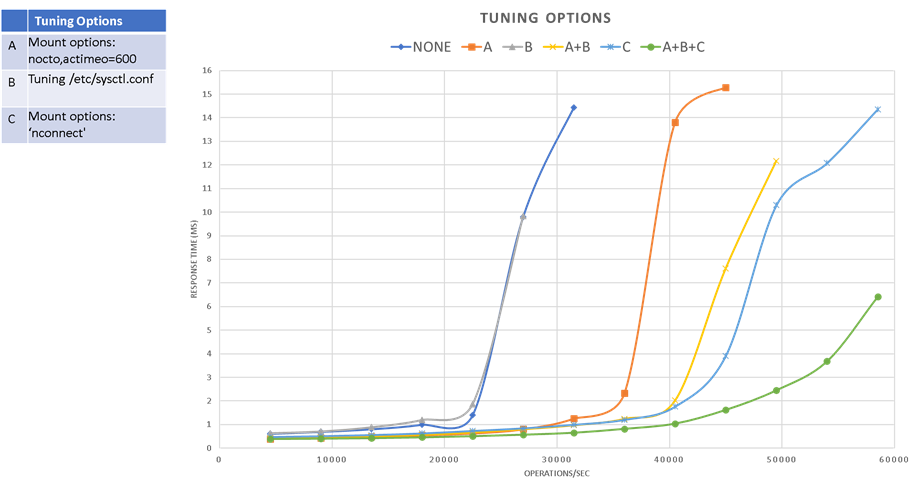

Other than the three options discussed above, below charts examine
several other characteristics, including NFS version, TCP/UDP and MTU
size, using the same EDA benchmarking tools.

NFS 4.1 shows poor performance compared to NFS 3, so be cautious on
using 4.1 if there's no specific security requirements. TCP performs
slightly better than UDP, and no significant impact with MTU size of
client VM.

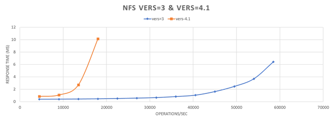
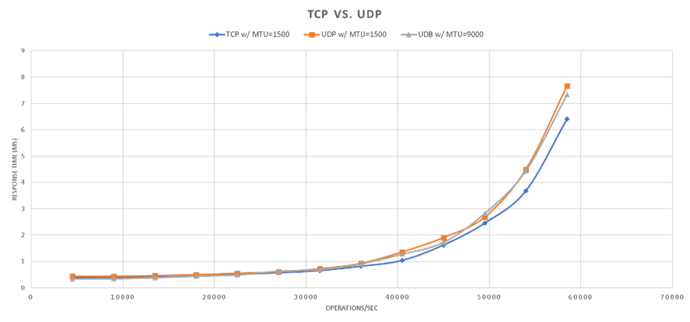
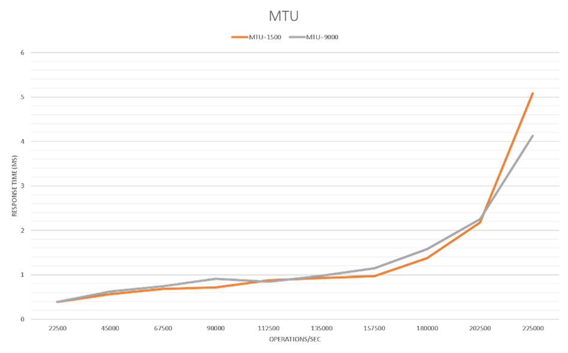

**Knowledge Check**

-   3 minutes

Choose the best response for each question. Then select **Check your
answers**.

**Check your knowledge.**

Top of Form

1.  Check the option(s) which can improve overall performance when
running EDA applications on ANF:

- Use 'nconnect' mount options.

- Use NFS 4.1 instead of NFS 3.0

- Use 'actimeo and nocto' mount options.

- Fine-tune value of rsize and wsize.

- Fine-tune sysctl.

Check your answers.

**Next Unit: Take-aways and resources.**

**Take-aways and resources.**

-   **Learn how to choose proper tier and volume size when running your
    HPC applications on Azure NetApp Files.**

-   **Learn how to create and configure ANF, and mount an ANF volume.**

-   **Learn practical performance tuning practice.**

Azure NetApp Files Product page:\
[Azure NetApp Files \| Microsoft
Azure](https://azure.microsoft.com/en-us/services/netapp/)

Azure NetApp Files documentation, how-to guides, and pricing:

[Azure NetApp Files documentation \| Microsoft
Docs](https://docs.microsoft.com/en-us/azure/azure-netapp-files/)
